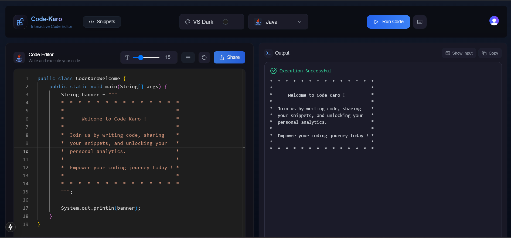

# 💻 Code Karo

> 🚀 An interactive, multi-language **online code editor** with real-time execution, snippet sharing, profile analytics, and a beautiful developer experience.

---

 

---

## ✨ Key Features

### 🧠 Code Editor
- 🛠️ Supports multiple programming languages (C++, Python, JavaScript, etc.)
- 🎨 Switchable editor themes (light/dark + custom themes)
- ⚙️ Real-time code execution via backend API integration
- 💾 Auto-save and code history support (coming soon)

### 🔐 Authentication
- 🔑 Login & Signup via [Clerk](https://clerk.dev)
- 🔒 Secure session handling with role-based access

### 📤 Snippet Sharing
- 📎 Share code snippets via public or private links
- ⭐ Star and favorite your favorite snippets
- 💬 Add and view comments on shared snippets
- 🔍 Filter snippets by language, author, or name

### 👤 Profile Dashboard
- 📊 Shows number of snippets created and starred
- 🌐 Analytics of languages used in the last 24 hours
- 🏆 Most used language and all-time execution history
- 🧾 Clean and dynamic UI to view developer activity

---

## ⚙️ Tech Stack

| Layer       | Tech Used                                 |
|--------------|-------------------------------------------|
| 🖥️ Frontend  | React.js, Tailwind CSS, Monaco Editor     |
| 🔧 Backend   | Node.js, Express.js, REST APIs            |
| 💽 Database  | MongoDB                                   |
| 🔐 Auth      | Clerk                                     |
| 🎨 UI Tools  | TailwindCSS, Custom Theme Configurations  |

---


## 🧑‍💻 Developed By

**Rudrakshi**  
📧 rudrakshisharma86@gmail.com  
🔗 [GitHub](https://github.com/itsrudra143) 

---

## 🏁 Getting Started

1. Clone the repository  
   ```bash
   git clone https://github.com/itsrudra143/codekaro
